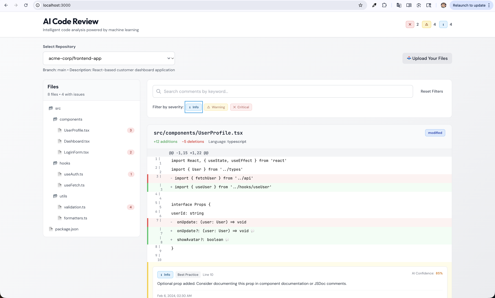
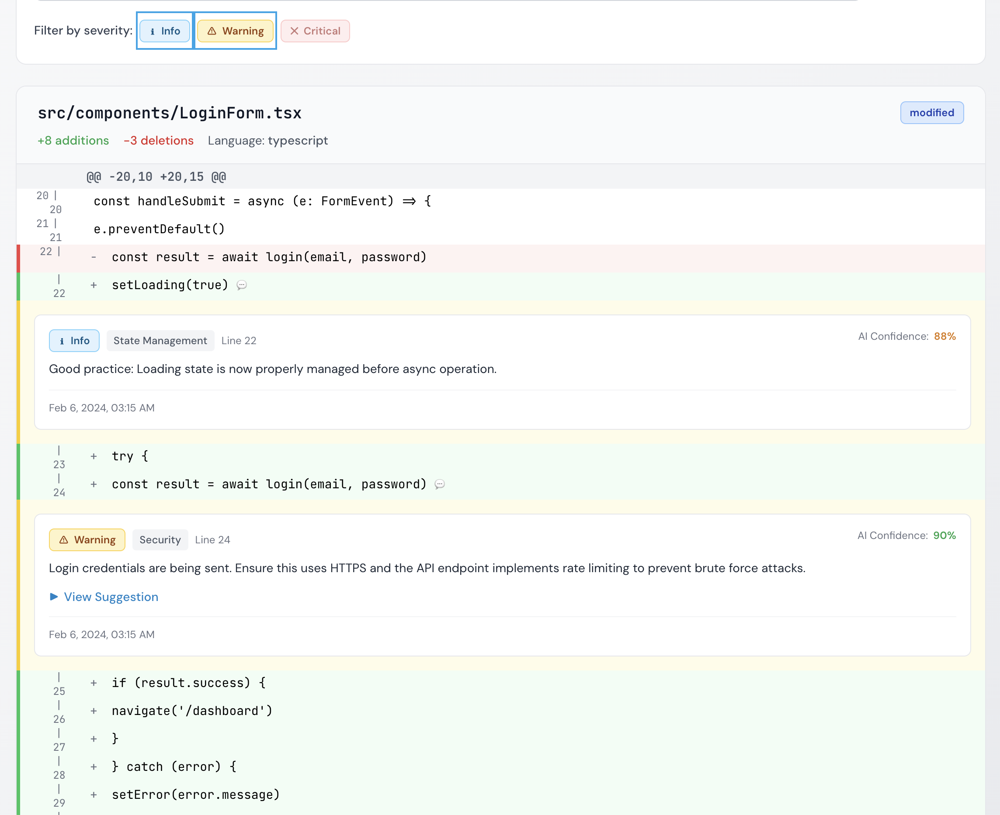
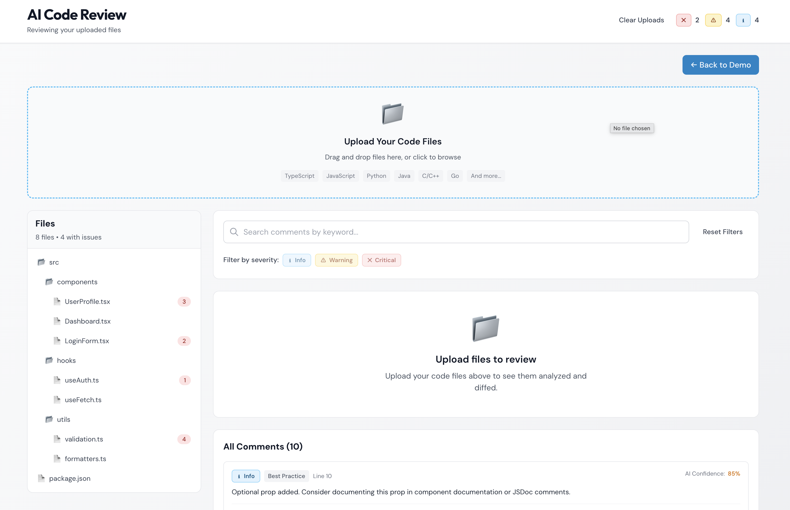
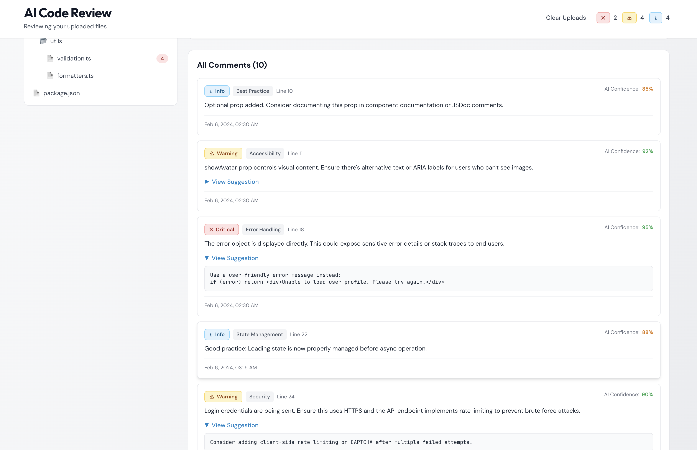

# AI Code Review Dashboard

A production quality frontend application for visualizing code diffs and AI generated review comments. Built with performance, accessibility, and maintainability as core principles.


## Why This Project?
As AI assisted code review tools become more common, developers still need fast, readable, and intuitive interfaces to understand and act on AI feedback. This project explores how modern frontend architecture, thoughtful UX, and performance optimizations can make AI powered code review practical and developer friendly similar to real world developer tools.

## Features

### Core Functionality
- **File Upload**: Drag & drop your own code files for instant diff viewing
- **Repository Selection**: Dropdown selector with repository metadata display
- **Interactive File Explorer**: Tree view with comment count badges and keyboard navigation
- **Advanced Diff Viewer**: Unified diff display with syntax highlighting and line numbers
- **AI Review Comments**: Inline comments with severity levels, categories, and AI confidence scores
- **Smart Filtering**: Filter by severity, search by keyword, and show only files with issues
- **Real-time Updates**: React Query powered data fetching with automatic caching

### Developer Experience
- **Full TypeScript**: Type-safe codebase with comprehensive type definitions
- **Keyboard Navigation**: Arrow keys (↑/↓) or vim-style (j/k) for file navigation
- **Responsive Design**: Mobile-first approach with adaptive layouts
- **Loading States**: Skeleton screens for better perceived performance
- **Error Handling**: Graceful error states with user-friendly messages

## Architecture Decisions

### State Management Strategy

**Zustand for UI State**
- Repository and file selection
- Filter configurations
- UI-specific state
- Simple, performant, and type-safe

**React Query for Server State**
- Data fetching and caching
- Automatic refetching and invalidation
- Loading and error states
- Optimistic updates

This separation provides clear boundaries between client and server state, improving maintainability and testability.

### Component Design Patterns

**Composition Over Inheritance**
- Small, focused components
- Reusable UI primitives
- Clear prop interfaces

**Memoization Strategy**
- `React.memo` for expensive list items (DiffLine)
- `useMemo` for derived data (filtered reviews, file counts)
- `useCallback` for event handlers passed to children

**Accessibility First**
- Semantic HTML elements
- ARIA labels and roles
- Keyboard navigation support
- Focus management
- Screen reader announcements

### Performance Optimizations

1. **Code Splitting**: Lazy loading ready (currently single-page app)
2. **Debounced Search**: 300ms delay to reduce unnecessary renders
3. **Virtual Scrolling Ready**: File tree structure supports future virtualization
4. **Memoized Renders**: DiffLine components are memoized to prevent re-renders
5. **Optimistic Updates**: React Query configuration for instant UI feedback

## Screenshots

### Repository & File Explorer


### Filtering & Navigation


### File Upload with AI Comments


### Diff Viewer with AI Comments


## Future Improvements

- Mocked APIs used to isolate frontend concerns
- Diff virtualization deferred due to current dataset size
- Test coverage focuses on critical interaction paths
- Backend integration can be added with minimal changes to the data layer

## To run the project

```bash
npm run dev
